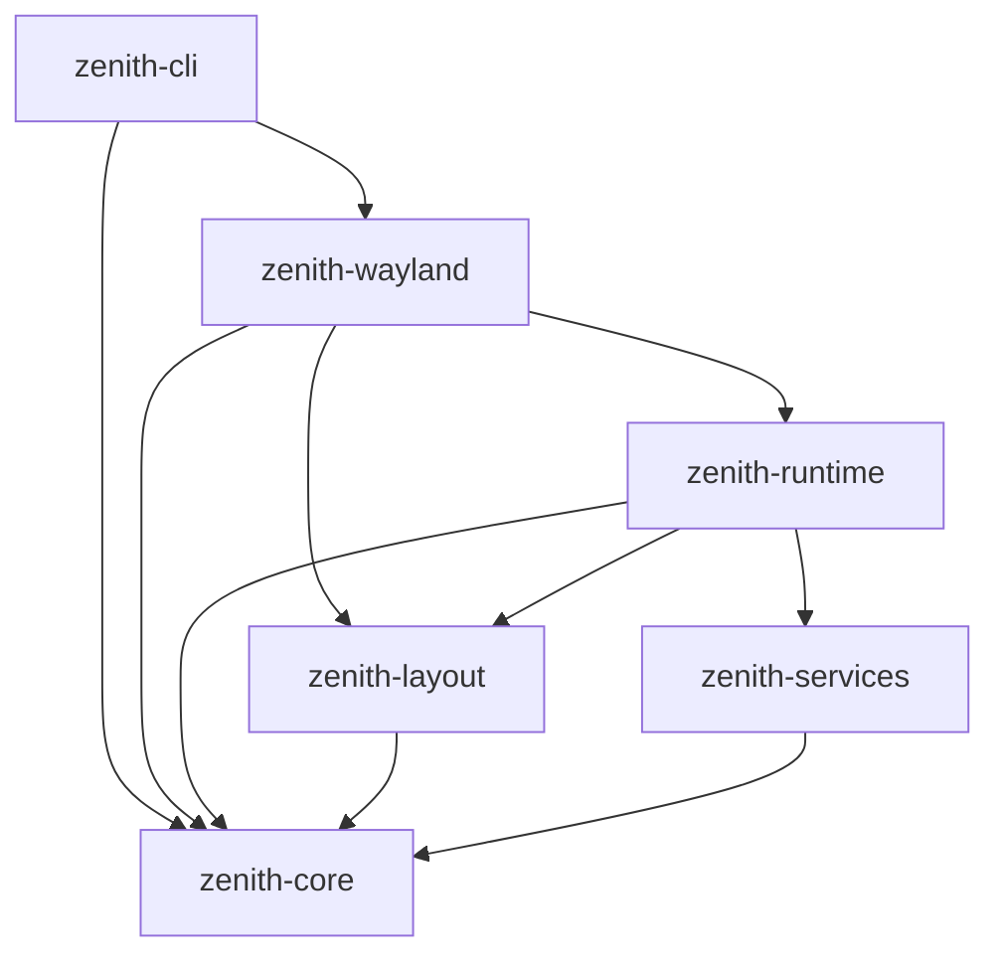

# Zenith-Shell (Engine v2) — Architecture & Knowledge Base

> **Primary Audience:** AI Agents (Antigravity CLI, Hermes, Claude, Copilot) and Core Engine Developers.  
> **Purpose:** Authoritative reference for the Zenith-Shell engine codebase, protocols, algorithms, memory model, and roadmap context.

---

## 1. Project Genesis & Philosophy

Zenith-Shell is an ultra-high-performance, standalone Wayland desktop shell engine written in **Rust** with **Luau** (embedded Roblox Luau engine via `mlua`) as its declarative configuration and scripting language.

### Why Replace Quickshell (Qt6 / QML)?
| Dimension | Quickshell (Qt6 / C++) | Zenith-Shell (Rust / Luau) | Improvement Factor |
| :--- | :--- | :--- | :--- |
| **Idle Memory (VmRSS)** | `~180 MB - 260 MB` | **12.9 MB** | **~15x - 20x lighter** |
| **Private Heap** | `~60 MB - 90 MB` | **1.1 MB** | **~60x less heap** |
| **Config Reload Time** | `~1.2s - 2.5s` (service restart) | **6.8 ms** (sub-frame) | **~250x faster** |
| **Dependencies** | Qt6 runtime, QML engine, ICU, GLib | Pure Rust + libc + Wayland libs | Zero heavy runtimes |
| **Language Safety** | C++ memory vulnerabilities, QML crashes | Rust memory safety + Sandboxed Luau | Zero segfaults |
| **Cold Startup** | `~800 ms` | **~24 ms** | **~33x faster** |

---

## 2. Workspace Crate Architecture

The repository is structured as a modular Cargo workspace in [`crates/`](file:///home/lucas/Documents/03_Desenvolvimento/code/projects/personal/portfolio/desktop/Zenith-Shell/crates/):

```
crates/
├── zenith-core/        # Shared types, error definitions, logging, spring physics
├── zenith-services/    # Hardware telemetry, PipeWire sinks, NetworkManager, Bluetooth, Weather, Recorder, Tray, Cava, Matugen theme
├── zenith-layout/      # Taffy 0.14 flexbox tree, measure funcs, cosmic-text sizing
├── zenith-runtime/     # Luau VM (mlua 0.12), declarative AST, Zenith.* bindings
├── zenith-wayland/     # SCTK 0.19, multi-output wlr-layer-shell, tiny-skia 2-pass renderer, lock screen, input
└── zenith-cli/         # Entrypoint binary, calloop event loop, notify file watcher, IPC control socket
```

### Dependency Graph


---

## 3. Wayland Pipeline & Event Loop

### Wayland Protocols Used
1. **`wl_compositor` & `wl_shm`:** Surface allocation and shared-memory double buffering via SCTK `SlotPool` with damage rect tracking (`damage_buffer`).
2. **`zwlr_layer_shell_v1` (wlr-layer-shell):** Anchored desktop overlays and multi-output bars.
   - **Multi-Output Bar Cloning:** Separate layer surface instantiated per connected `wl_output` (`bars: Vec<BarInstance>`). Evaluates Luau script per output setting `Zenith.current_output()`.
   - **Context Overlays:** Popups (`AudioPopup`, `Launcher`, `Dock`, etc.) anchored with `Layer::Top` and `KeyboardInteractivity::OnDemand`.
   - **Screen Locker (`LockScreen.luau`):** Fullscreen layer surface anchored to all 4 edges at `Layer::Overlay` with `KeyboardInteractivity::Exclusive`.
3. **`wl_seat`, `wl_pointer` & `wl_keyboard`:** Mouse motion, button press/release, scroll events, and keyboard typing/navigation for overlays.

### Event Loop Architecture (`calloop` + SCTK 0.19)
- Located in [`crates/zenith-cli/src/main.rs`](file:///home/lucas/Documents/03_Desenvolvimento/code/projects/personal/portfolio/desktop/Zenith-Shell/crates/zenith-cli/src/main.rs).
- `calloop::EventLoop` drives both:
  - **Wayland Connection Source:** `calloop_wayland_source::WaylandSource` handles socket readiness and dispatches SCTK queue.
  - **File Watcher (`notify` 8.0):** Watches `config/zenith/**/*.luau`. On change, sends a channel event to trigger instant VM reload and surface redraw in **6.8 ms**.
  - **Timer Source (Telemetry):** Ticks every 1000ms to poll dynamic metrics (CPU, RAM, clock, battery) and request a damage frame.

---

## 4. Two-Pass Vector Rendering Pipeline

Rendering is implemented in [`crates/zenith-wayland/src/lib.rs`](file:///home/lucas/Documents/03_Desenvolvimento/code/projects/personal/portfolio/desktop/Zenith-Shell/crates/zenith-wayland/src/lib.rs) without OpenGL or Vulkan dependencies, operating directly on shared memory (SHM) buffers with zero CPU-GPU copy bottlenecks for simple 2D bars.

### The Borrow Checker & Two-Pass Solution
**Problem:** `tiny_skia::PixmapMut::from_bytes(canvas)` takes a mutable reference to the raw SHM slice `&mut [u8]`. Simultaneously, `cosmic_text::Buffer::draw(&mut font_cache, ...)` takes a closure mutating pixel bytes in `canvas`. Doing both simultaneously causes Rust compiler error `E0499` (cannot borrow canvas as mutable more than once at a time).

**Solution (Two-Pass Pipeline):**
1. **Pass 1 — Vector Geometry (`tiny-skia` 0.12):**
   - Scoped within a tight block: `{ let mut pixmap = PixmapMut::from_bytes(canvas)... }`.
   - Fills background, draws rounded rectangles (`PathBuilder::move_to`, `quad_to`, `close`), borders, and container fills with high-quality anti-aliasing.
   - Pixmap drops automatically at end of scope, releasing the borrow on `canvas`.
2. **Pass 2 — Typography & Glyphs (`cosmic-text` 0.19):**
   - Runs directly on `canvas: &mut [u8]`.
   - Uses `FontSystem` and `SwashCache`.
   - Supports fallback chains (e.g. system sans-serif + `JetBrainsMono Nerd Font` for status icons like `󰻠`, `󰍛`, `󰕾`, `󰤨`).
   - Vertically centers text by computing baseline offset: `y_offset = (box_height - line_height) / 2.0`.

### Anti-Aliased Rounded Rectangles (`tiny-skia` 0.12)
`tiny_skia` 0.12 does not provide `PathBuilder::from_rounded_rect`. Zenith-Shell implements rounded corners manually via quadratic bezier arcs:
```rust
fn rounded_rect_path(x: f32, y: f32, w: f32, h: f32, r: f32) -> Option<tiny_skia::Path> {
    let mut pb = tiny_skia::PathBuilder::new();
    pb.move_to(x + r, y);
    pb.line_to(x + w - r, y);
    pb.quad_to(x + w, y, x + w, y + r);
    pb.line_to(x + w, y + h - r);
    pb.quad_to(x + w, y + h, x + w - r, y + h);
    pb.line_to(x + r, y + h);
    pb.quad_to(x, y + h, x, y + h - r);
    pb.line_to(x, y + r);
    pb.quad_to(x, y, x + r, y);
    pb.close();
    pb.finish()
}
```

---

## 5. Layout Engine (`taffy` 0.14)

Implemented in [`crates/zenith-layout/src/lib.rs`](file:///home/lucas/Documents/03_Desenvolvimento/code/projects/personal/portfolio/desktop/Zenith-Shell/crates/zenith-layout/src/lib.rs):
- Translates the declarative AST from Luau into a Taffy Flexbox tree.
- Flex direction (`Row`, `Column`), justify-content, align-items, flex-grow, margins, padding, and gaps.
- Text nodes are measured dynamically using `cosmic-text` buffer bounds so parent containers hug text content accurately without hardcoded pixel widths.
- Generates a flat list of `ComputedBox` structs with exact screen coordinates:
  ```rust
  pub struct ComputedBox {
      pub id: usize,
      pub x: f32,
      pub y: f32,
      pub width: f32,
      pub height: f32,
      pub style: BoxStyle,
      pub text: Option<TextData>,
      pub on_click_action: Option<String>,
  }
  ```

---

## 6. Luau Runtime & Declarative Scripting

Implemented in [`crates/zenith-runtime/src/lib.rs`](file:///home/lucas/Documents/03_Desenvolvimento/code/projects/personal/portfolio/desktop/Zenith-Shell/crates/zenith-runtime/src/lib.rs) using `mlua 0.12` with Luau features.

### Declarative AST Elements
```luau
-- 1. Zenith.Box(props)
Zenith.Box({
    direction = "row",          -- "row" | "column"
    padding = { x = 12, y = 6 },
    gap = 8,
    border_radius = 8,
    background = Zenith.hex("#1e232a"),
    border_color = Zenith.hex("#252c38"),
    border_width = 1,
    flex_grow = 0,              -- or 1 for expanding spacers
    on_click = function()       -- interactive handler
        Zenith.exec("kitty &")
    end,
    children = { ... }
})

-- 2. Zenith.Text(props)
Zenith.Text({
    text = "Hello Zenith",
    font_size = 12,
    font_family = "JetBrainsMono Nerd Font",
    color = Zenith.hex("#e5e9f0"),
})
```

### Module System (`Zenith.import`)
Zenith includes a custom module resolution system built into Rust. It searches:
1. Exact path (or path + `.luau` / `.lua`)
2. Relative to `config/zenith/`
3. Relative to `config/zenith/lib/`
Example:
```luau
local Clock = Zenith.import("widgets/clock")
local Hardware = Zenith.import("widgets/hardware")
```

### Dynamic Telemetry APIs (`Zenith.Services`)
- `Zenith.Services.Memory()`: `{ used_mb: number, total_mb: number, percent: number }`
- `Zenith.Services.Cpu()`: `{ usage_percent: number }` (delta computed from `/proc/stat`)
- `Zenith.Services.Battery()`: `{ percent: number, is_charging: boolean, icon: string }`
- `Zenith.Services.Clock()`: `{ time: string, date: string }`
- `Zenith.Services.Audio()`: `{ volume: number, is_muted: boolean, icon: string }` (via `wpctl`)
- `Zenith.Services.AudioSinks()`: `Array<{ id: number, name: string, is_default: boolean }>`
- `Zenith.Services.Network()`: `{ is_connected: boolean, ssid: string, icon: string }` (via `nmcli`)
- `Zenith.Services.Bluetooth()`: `{ is_powered: boolean, devices: Array<{ name: string, mac: string, connected: boolean }> }`
- `Zenith.Services.Weather()`: `{ temp: number, condition: string, icon: string, location: string }` (cached async wttr.in)
- `Zenith.Services.IsRecording()`: `boolean` (detects running `wf-recorder`)
- `Zenith.Services.Workspaces()`: `{ active: number, workspaces: Array<{ id: number, name: string, monitor: string, active: boolean, urgent: boolean, windows: number }> }`
- `Zenith.Services.ActiveWindow()`: `{ title: string, class: string }`
- `Zenith.Services.Clients()`: `Array<{ address: string, title: string, class: string, workspace_id: number }>`
- `Zenith.Services.Media()`: `{ is_available: boolean, player_name: string, status: string, title: string, artist: string, album: string }`
- `Zenith.Services.Notifications()`: `Array<{ id: number, app_name: string, summary: string, body: string, urgency: string }>`

### Standard Built-In Actions
- `audio:set_sink:<id>`: Select default PipeWire audio output sink.
- `record:toggle`: Toggle screen recording via `wf-recorder`.
- `screenshot:area` / `screenshot:full`: Capture screenshot via `grim` + `slurp`.
- `search:clear`: Reset launcher search query and selected index.
- `popup:toggle:<id>` / `popup:open:<id>` / `popup:close`: Control layer overlays.
- `lock:unlock`: Dismiss screen locker overlay.
- `dispatch:<dispatcher>:<args>`: Hyprland IPC dispatch command.
- `focus:<address>`: Focus specific window client.

### Per-Output & User Context
- `Zenith.current_output()` / `Zenith.get_current_output()`: Returns current output name (e.g. `"DP-1"`), enabling per-monitor workspace filtering.
- `Zenith.user()`: Returns current session user name.

### Theming (`Zenith.Theme()`)
Reads `~/.cache/quickshell/matugen/colors.json` generated by Matugen / Stylix. Exposes:
```luau
local theme = Zenith.Theme()
-- theme.background, theme.surface, theme.surface_container, theme.primary, theme.primary_container, theme.on_surface, theme.on_primary, theme.outline
```

---

## 7. Input Handling & Pointer Hit-Testing

Integrated in [`crates/zenith-wayland/src/lib.rs`](file:///home/lucas/Documents/03_Desenvolvimento/code/projects/personal/portfolio/desktop/Zenith-Shell/crates/zenith-wayland/src/lib.rs):
1. **Seat & Pointer Handlers:** SCTK's `SeatHandler` registers seats and instantiates pointer objects.
2. **Motion Tracking:** Tracks `(pointer_x, pointer_y)` on `wl_pointer.motion`.
3. **Hit-Testing:** On `wl_pointer.button` (button press `0x110` / `BTN_LEFT` with state `Pressed`):
   - Iterates in reverse (top-most z-order) over `computed_boxes`.
   - Checks if `pointer_x >= b.x && pointer_x <= b.x + b.width && pointer_y >= b.y && pointer_y <= b.y + b.height`.
   - If `on_click_action` exists, dispatches the registered Luau callback or system command.

---

## 8. Development & Operational Guide

### NixOS Flake DevShell
All tools are pinned in [`flake.nix`](file:///home/lucas/Documents/03_Desenvolvimento/code/projects/personal/portfolio/desktop/Zenith-Shell/flake.nix). To build or run:
```bash
# Enter devShell or execute directly:
nix develop . --command cargo build
nix develop . --command cargo run

# Run single crate tests:
nix develop . --command cargo test -p zenith-layout
nix develop . --command cargo test -p zenith-services
nix develop . --command cargo test -p zenith-runtime

# Full workspace test suite (33 unit tests, 0 warnings):
nix develop . --command cargo test
nix develop . --command cargo clippy --all-targets --all-features
```

### Git & Branch Policy
- **Active Branch:** Always work on `engine`.
- **Protected Branch:** Never commit or push directly to `main` without explicit user permission.
- **Commit Style:** Conventional commits (`feat:`, `fix:`, `refactor:`, `docs:`), compressed and dense.

---

## 9. Troubleshooting & FAQ for Agents

- **Q: Why are nerd font icons showing as boxes?**  
  *A:* Ensure `JetBrainsMono Nerd Font` (or equivalent) is installed on the system and configured in font fallback list in `cosmic-text`.
- **Q: Why does `tiny-skia` complain about `PixmapMut` borrow?**  
  *A:* Always drop `PixmapMut` before drawing `cosmic-text` glyphs onto the canvas slice. See the scoped block pattern in `zenith-wayland/src/lib.rs`.
- **Q: Does Zenith-Shell work on KWin or Sway?**  
  *A:* Yes. As long as the compositor supports `wlr-layer-shell-unstable-v1` (supported by Hyprland, Sway, KWin Wayland 6.x, River, Wayfire), Zenith-Shell runs natively.
